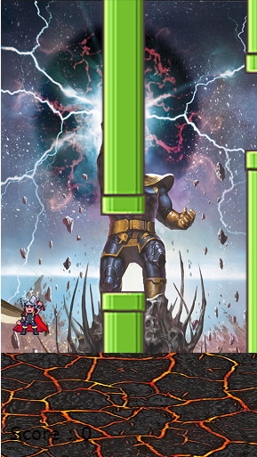

# Javascript-meets-marvel
In This repository I create a flappy bird like game in pure javascript but only with a twist, instead of the flappy bird it'll be thor.
Rember this is written in pure javascript and html 5. The code should be pretty clear and easy to follow. You can easily substitute thor 
for someone else as well as change the background just make sure you pay special attention to the scaling. 

